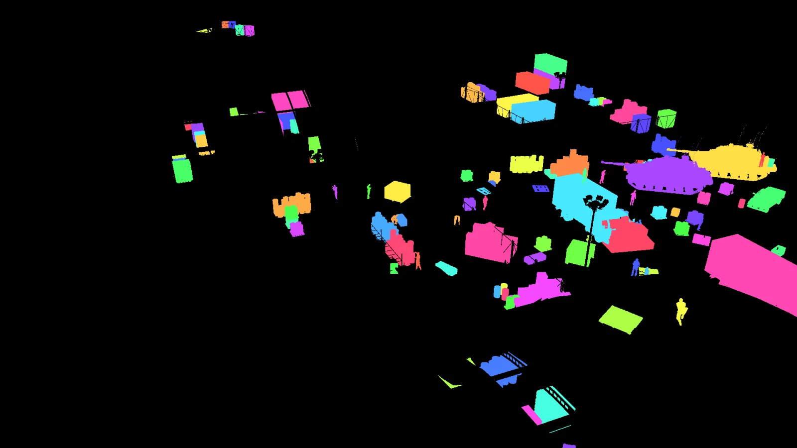
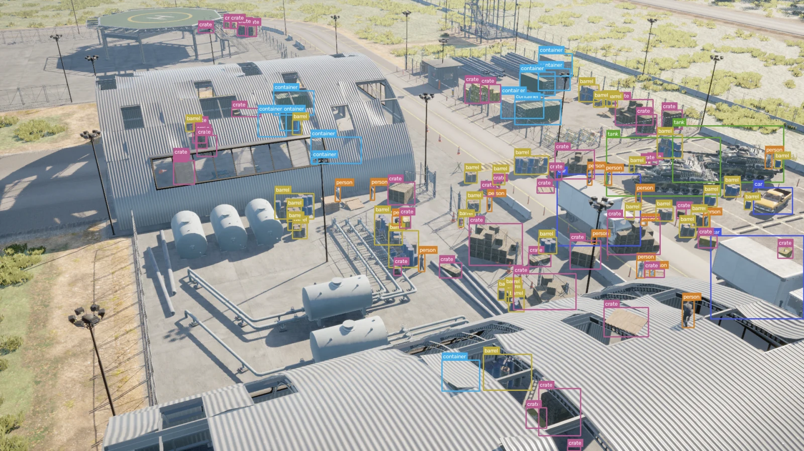

# NameFrame Synthetic Data Samples for Unreal Engine

Inspectable outputs and dataset cards produced with NameFrame, an Unreal-native synthetic-data studio for computer vision.

[Explore the visual dataset gallery](https://nameframe-uploader.github.io/nameframe-synthetic-data/) · [Download sample datasets](https://getnameframe.com/datasets) · [Read the documentation](https://getnameframe.com/docs) · [Apply for a pilot](https://getnameframe.com/pilot)

> This repository contains public sample outputs and supporting material. It does not contain the NameFrame plugin, pipeline source code, binaries, private APIs or internal implementation.

## One captured frame, multiple aligned outputs

NameFrame records rendered RGB, a per-instance identity buffer, metric depth and per-frame scene truth from the same Unreal Engine capture. Detection boxes, instance masks, metadata and dataset exports are derived from that recorded truth.

| RGB | Instance IDs | Depth | Derived boxes |
| --- | --- | --- | --- |
|  |  |  |  |

## Public inspection samples

| Dataset | Intended inspection task | Source run | Packaged sample | Classes | Resolution | Reported grade |
| --- | --- | ---: | ---: | ---: | --- | --- |
| [Airbase](./datasets/airbase/) | Aerial detection and instance segmentation in cluttered ground scenes | 40 frames | 13 unique frames across two archives | 6 | 1920×1080 | A · 92.4/100 |
| [Barnyard](./datasets/barnyard/) | Small-object detection from near-nadir, low-altitude views | 300 frames | 12 frames | 7 | 1280×960 | C · 78.3/100 |

These packages are inspection samples, not benchmarks. Each dataset card states its known limitations. The Airbase downloads include the reports used to grade the run. The configured Barnyard archive is currently unavailable, so this repository does not present a working download button for it.

## What you can inspect here

- RGB frame previews
- per-instance identity-buffer visualisations
- metric-depth visualisations where published
- representative YOLO and COCO annotations
- sanitised per-frame metadata examples
- dataset cards, quality findings and known limitations
- citations, archive hashes and links to verified official downloads

## What is not published here

- NameFrame plugin or pipeline source code
- Unreal Engine plugin binaries or sample projects
- internal validation or scene-generation algorithms
- private API, CLI or MCP implementations
- complete private schemas or production configuration

NameFrame is proprietary software. Public access to this repository does not make the product open source.

## Start with the data

- [Browse all NameFrame sample datasets](https://getnameframe.com/datasets)
- [Inspect the Airbase capture](https://getnameframe.com/datasets/airbase)
- [Inspect the Barnyard capture](https://getnameframe.com/datasets/barnyard)
- [Read how NameFrame reports dataset quality](https://getnameframe.com/quality)
- [Read the NameFrame documentation](https://getnameframe.com/docs)

## Terms

Repository materials and dataset samples are provided under the terms in [LICENSE.md](./LICENSE.md) and [DATA_TERMS.md](./DATA_TERMS.md). Third-party environment and prop content may remain subject to its original licence. No trademark or software licence is granted.

The copyright name in these files mirrors the current NameFrame source-repository notice. Legal approval, asset-rights confirmation and DNS activation remain explicit launch gates in [LAUNCH_CHECKLIST.md](./LAUNCH_CHECKLIST.md).

## Citation

Use the citation included in the relevant dataset card or the repository metadata in [CITATION.cff](./CITATION.cff). Cite the exact dataset version, map and seed where available.

## Contact

Product and pilot enquiries: [hello@getnameframe.com](mailto:hello@getnameframe.com)

Frame the world. Name the frames.
